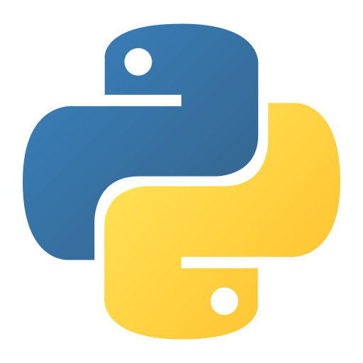

  

    
    

      
      
      
    

    

      
      
      
    

    

      
    

  

  <h1>Hello! 👋</h1>
  
I'm a High School IT Student which likes to program and occasionaly play games!

  <h2>What I'm currently learning 🌱 </h2>

  
I'm currently learning JavaScript.

  
I'm learning the usage of Linux. (Ubuntu, Bash Terminal)

  <h2>Projects ✨</h2>
  
  
Started making a Python project, which i'll maybe publish on GitHub soon. 👀

  

    I helped <a href="https://github.com/mini-bomba">@mini-bomba<a/>, with his Enderman Bot on Discord. You can invite the bot by clicking
    <a href="https://discord.com/oauth2/authorize?client_id=676496144800415746&permissions=8&response_type=code&scope=bot">
      here!
    </a>
  

  
  <h2>My current goals 🏁</h2>

  
I want to publish my first project made in Python.

  
I want to get more familiar with Linux.

  
I want to publish my first website.

<!--
No, i am not deleting this
**aasd24/aasd24** is a ✨ _special_ ✨ repository because its `README.md` (this file) appears on your GitHub profile.

Here are some ideas to get you started:

- 🔭 I’m currently working on ...
- 🌱 I’m currently learning ...
- 👯 I’m looking to collaborate on ...
- 🤔 I’m looking for help with ...
- 💬 Ask me about ...
- 📫 How to reach me: ...
- 😄 Pronouns: ...
- ⚡ Fun fact: ...
-->
